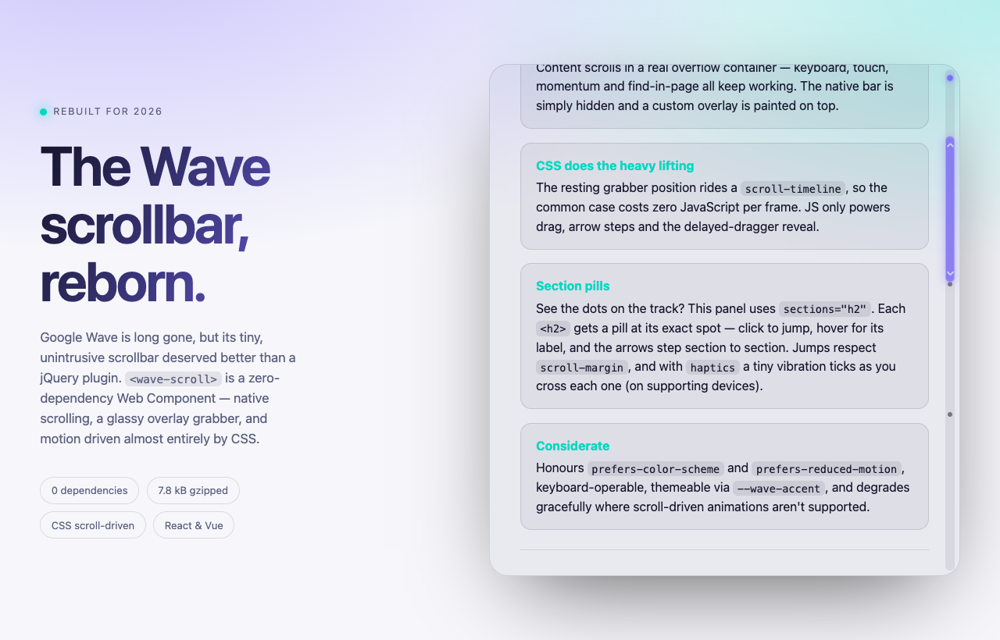

<div align="center">

# 〰️ wave-scroll

### The Google Wave scrollbar, rebuilt for 2026.

A **zero-dependency Web Component** that reimagines Google Wave's tiny, unintrusive
scrollbar — native scrolling, a glassy overlay grabber, and motion driven almost
entirely by CSS.

[](https://developer.mozilla.org/docs/Web/API/Web_components)
[](#)
[](#)
[](#-react)
[](#)
[](#license)

### [▶ Live demo →](https://eboye.github.io/google-wave-scrollbar/)

<br />

[](https://eboye.github.io/google-wave-scrollbar/)

</div>

---

## ✦ Why

Google Wave is long gone, but its scrollbar deserved better than a jQuery plugin.
In its tiny form-factor, the original managed to:

- 📏 **Indicate document height**
- 📍 **Show the current scroll location**
- 🔼 **Scroll by clicking the arrows** — the dragger doesn't move until you move your mouse away
- ✋ **Scroll by dragging**

Fifteen years on, the platform finally has the primitives to express that idea
natively. This is that scrollbar, rebuilt from scratch with **no dependencies** —
no jQuery, no jQuery UI, no sprite PNGs.

> Originally based on the [Konr Ness](http://konrness.com) jQuery plugin.

---

## ✦ Highlights

| | |
|---|---|
| 🪶 **Native by default** | Content scrolls in a real overflow container — keyboard, touch, momentum, and find-in-page all keep working. The native bar is hidden; a custom overlay is painted on top. |
| 🎞️ **CSS-first motion** | The resting grabber position rides a CSS `scroll-timeline`, so wheel / trackpad / keyboard scrolling costs **zero JavaScript per frame**. |
| 〰️ **Faithful behavior** | JS powers only the three Wave signatures: drag-to-scrub, arrow step-scroll, and the *delayed dragger* (the grabber lingers while a thin indicator shows where you're heading, then glides over once the pointer leaves). |
| 🌗 **Considerate** | Honours `prefers-color-scheme` and `prefers-reduced-motion`, encapsulated in Shadow DOM, themeable, and degrades gracefully where scroll-driven animations aren't supported. |

---

## ✦ Install

**Plain HTML** — no build step, just drop in the module:

```html
<script type="module" src="wave-scroll.js"></script>
```

**Or via npm** (ships with TypeScript types and React / Vue wrappers):

```sh
npm install wave-scroll
```

```js
import 'wave-scroll';        // registers the <wave-scroll> element
```

---

## ✦ Usage

Wrap your content and give the element a sized container:

```html
<wave-scroll accent="#7c6cff">
  <article>
    <!-- …your long content… -->
  </article>
</wave-scroll>
```

```css
wave-scroll {
  display: block;
  block-size: 100%; /* fills its host; give it a height */
}
```

That's the whole API.

---

## ✦ Attributes

| Attribute | Description |
|-----------|-------------|
| `accent` | Theme color for the grabber & indicator. Also settable via the `--wave-accent` CSS custom property. |
| `auto-hide` | Only reveal the bar on hover / interaction. |
| `no-arrows` | Hide the up/down step buttons for a cleaner, minimal bar. |
| `sections` | Show jump-to **section pills** along the track. Boolean (default `h2`) or a CSS selector — see below. |
| `haptics` | With `sections`, emit a tiny [Vibration-API](https://developer.mozilla.org/docs/Web/API/Navigator/vibrate) tick when scrolling crosses into a new section (where supported, e.g. Android). |

### Section pills

Opt in with `sections` to scatter clickable **pills** along the track — one per
section, positioned exactly where the grabber lands for that section:

```html
<!-- default: one pill per <h2> -->
<wave-scroll sections>…</wave-scroll>

<!-- or a custom selector -->
<wave-scroll sections="h2, h3">…</wave-scroll>
```

- **Click a pill** to smooth-scroll to that section.
- **Hover** a pill to see its label (the element's text) in a tooltip.
- The pill for the section **currently in view** highlights as you scroll.
- The **up/down arrows step between sections** (previous / next) when `sections`
  is on, instead of a fixed pixel step.
- Jumps respect **`scroll-margin-top`** (on the section) and **`scroll-padding-top`**
  (on the scroller), so targets clear sticky headers.
- Add **`haptics`** for a subtle vibration tick as you cross sections (supported
  devices only).
- Elements marked `data-wave-section="Label"` are **always** included (on top of
  the selector), with the attribute value as the label:

  ```html
  <section data-wave-section="Pricing">…</section>
  ```

Style the pills via `::part(pill)`. Leave `sections` off and nothing changes —
it's purely additive.

### Theming

Every visual knob is a CSS custom property you can override:

```css
wave-scroll {
  --wave-accent: #00d9c0;   /* grabber & indicator color */
  --wave-size: 12px;        /* bar width */
  --wave-min-grabber: 36px; /* smallest grabber height */
  --wave-track-inset: 6px;  /* gap from the edges */
  --wave-fade: 220ms;       /* reveal / fade timing */
}
```

You can also style the internals via `::part()`:

```css
wave-scroll::part(grabber) { box-shadow: 0 2px 12px #0008; }
wave-scroll::part(track)   { background: #fff2; }
```

---

## ✦ React

A thin, typed wrapper forwards a ref to the element and maps camelCase props to
attributes:

```jsx
import { WaveScroll } from 'wave-scroll/react';

export function App() {
  return (
    <WaveScroll accent="#7c6cff" autoHide style={{ height: '100%' }}>
      <article>…your long content…</article>
    </WaveScroll>
  );
}
```

Props: `accent`, `autoHide`, `noArrows`, `sections`, `haptics`, plus `className` / `style` / `ref`.

> Since it's a real custom element, you can also skip the wrapper and write
> `<wave-scroll>` directly after `import 'wave-scroll'` — React 19 passes
> props through cleanly.

## ✦ Vue

```vue
<script setup>
import { WaveScroll } from 'wave-scroll/vue';
</script>

<template>
  <WaveScroll accent="#7c6cff" auto-hide style="height: 100%">
    <article>…your long content…</article>
  </WaveScroll>
</template>
```

> Prefer the raw tag in a template? Import `'wave-scroll'` and tell Vue
> it's a custom element so it doesn't try to resolve it as a component:
>
> ```js
> // vite.config.js
> vue({ template: { compilerOptions: { isCustomElement: (t) => t === 'wave-scroll' } } })
> ```

---

## ✦ Demo

**Live:** [eboye.github.io/google-wave-scrollbar](https://eboye.github.io/google-wave-scrollbar/)

Or run it locally — serve the folder over HTTP and open `index.html`:

```sh
python3 -m http.server
# → http://localhost:8000
```

---

## ✦ How it works

```
┌─ <wave-scroll> ─────────────────────────────┐
│  ┌─ .viewport (native overflow:auto) ─────┐ │
│  │   scroll-timeline: --wave-y            │ │  ← real, native scrolling
│  │   <slot> your content </slot>          │ │
│  └────────────────────────────────────────┘ │
│                                       ┌────┐ │
│   overlay bar (Shadow DOM)            │ ▲  │ │  ← grabber rides the
│                                       │ ▓▓ │ │     scroll-timeline in CSS
│                                       │ ▼  │ │
│                                       └────┘ │
└──────────────────────────────────────────────┘
```

The grabber's `translateY` is keyed to a CSS `scroll-timeline`, so the browser
moves it on the compositor as you scroll — no per-frame JavaScript. JS steps in
only for drag, arrow clicks, and the delayed-dragger reveal, then hands control
straight back to the timeline with no visual snap.

---

## License

[MIT](#license).
